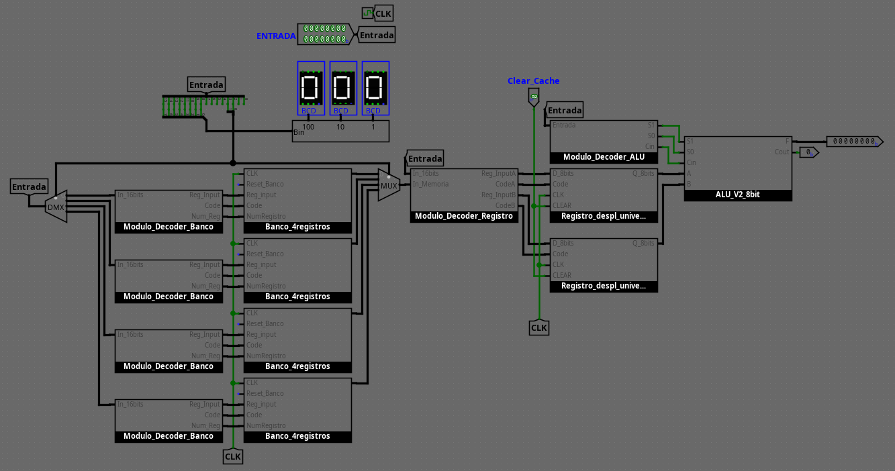
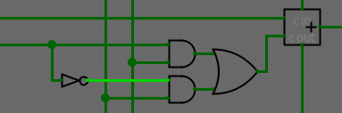
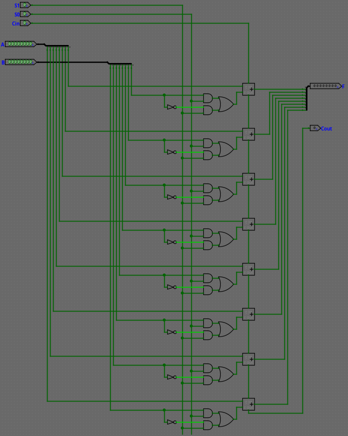
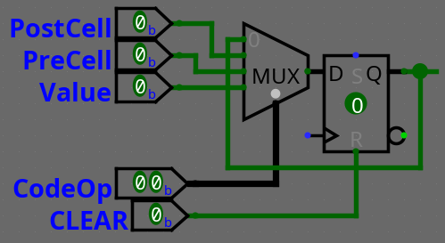
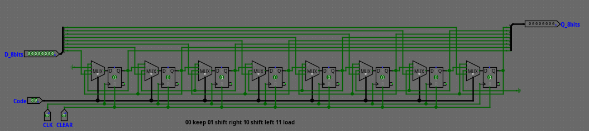

# Computer in logisim

This is a very basic computer created in [Logisim Evolution](https://github.com/logisim-evolution/logisim-evolution). It only has simple functionalities implemented, which means it can work as a simple calculator with storage.

## Features

The computer is capable of performing ONLY ONE OPERATION PER CYCLE. These operations are divided into 4 groups:

- In-memory data manipulation
- Cached data manipulation
- Saving the ALU result in memory
- Arithmetic operations in the ALU

## Usage

This computer has a simple operation, based on some simple basic rules. 
- The computer allows data to be directly loaded into memory banks and cache memory.
- To operate with two numbers, they must be in the respective caches.
- The only asynchronous element of the computer is the ALU.
- The numbers are encoded with 8 bits in two’s complement. Therefore, the range of numbers is from -128 to 127.

## Binary instruction encoding

The last 2 bits will always correspond to the operating mode.

### In-memory data manipulation

This type of instruction allows you to modify some of the data stored in the memory banks. The available mods are shift and write.

This instruction is divided into 5 fields. From left to right: number to be loaded (in case of loading), action code, cell identifier, bank identifier and action code.

- The number corresponds to the first 8 bits. This will only be significant in case of load. Otherwise, those positions can have any value.

- The action code is encoded in 2 bits.
    - 00 -> Maintains the previous value.
    - 01 -> Shift right one position.
    - 10 -> Shift left one position.
    - 11 -> Load the value stored in the first 8 bits.

- The cell number, encoded in 2 bits. There are 4 cells per bank, so these are coded in binary from the number 0 (00) to 3 (11).

- The bank number, encoded in 2 bits. There are 4 records, and these are coded in the same way as the cells.

- Action code. For in-memory data manipulation, the action code is always 00.

Example: 
[00100001|11|10|01|00] 
Loading the number 33, in cell 2 of bank 1.

Example: 
[xxxxxxxx|01|11|10|00] 
Shift right the value found in cell 3 of record 2 one position to the right.

### Cached data manipulation

This type of instruction allows you to modify the information in the registers. In turn, it contains two subtypes: Immediate or direct loading, and loading from memory. The ninth largest bit decides whether the instruction is of subtype 0 (immediate loading) or subtype 1 (loading from memory).

#### Subtype 0 (Immediate loading)

This instruction subtype contains 6 fields, corresponding, from left to right, to the number being loaded, the operation subtype (0), two empty bits, the action code, the target register and the type code (01).

- The number corresponds to the first 8 bits. This will only be significant in case of load. Otherwise, those positions can have any value.

- The subtype is encoded with a bit, 0 in this case (immediate loading).

- Two insignificant bits.

- The action code is encoded in 2 bits.
    - 00 -> Maintains the previous value.
    - 01 -> Shift right one position.
    - 10 -> Shift left one position.
    - 11 -> Load the value stored in the first 8 bits.

- The selection of register A or register B is encoded with one bit. This is 0 for the first case, and 1 for the second.

- Action code. For cached data manipulation, the action code is always 01.

Example:
[00100001|0|xx|11|0|01] 
Loading number 33, in register A.

Example: 
[xxxxxxxx|0|xx|10|1|01] 
Shift left the value found in register B.

#### Subtype 1 (Load from memory)

This instruction subtype contains 6 fields, corresponding, from left to right, 8 empty bits, the operation subtype (0), the cache to modify, the cell and the bank from which the number is obtained and the type code (01).

- The first 8 bits are insignificant, because the number will be obtained from memory.

- The subtype is encoded with a bit, 1 in this case (load from memory).

- 1 bit to choose the caché to modify (0=A, 1=B)

- The cell number, encoded in 2 bits. There are 4 cells per bank, so these are coded in binary from the number 0 (00) to 3 (11).

- The bank number, encoded in 2 bits. There are 4 records, and these are coded in the same way as the cells.

- Action code. For cached data manipulation, the action code is always 01.

Example:
[xxxxxxxx|1|0|10|11|01] 
Load into cache A the number stored in cell 2 of bank 3.

### Save ALU result in memory

This instruction allows the result obtained in the arithmetic logic unit (ALU) to be stored in memory. The fields of this instruction are 5: 8 empty bits, 2 bits of register action code (11), then 2 bits to choose the memory cell, and another 2 bits to choose the bank. Finally, the code for this instruction (10).

#### ||| This function will be implemented in the future |||

### ALU Operation

With this instruction, we will operate with the values previously loaded in records A and B. This is the only asynchronous operation of the computer. It consists of 11 empty bits, 3 operation, and 2 bits of the Instruction Code (11).

- 11 bits vacios

- 3 bits operation
  - 000 Transfer A
  - 001 A++
  - 010 A+B
  - 011 A+B+1
  - 100 A+(¬B) 1's Complement
  - 101 A+(¬B)+1 2's Complement
  - 110 A--
  - 111 Transfer A

## Parts of the computer

### ALU

This ALU is made up of 1 bit cells.

Chaining 8 of these, we can assemble the 8bits ALU.

### Register

The records are based on Flip-Flops type D the version with displacement, which is finally used, is composed of unit modules.

If we connect these chain modules with each other, both towards the following cell and to the previous one, we manage to register 8Bits with displacement in both directions.

